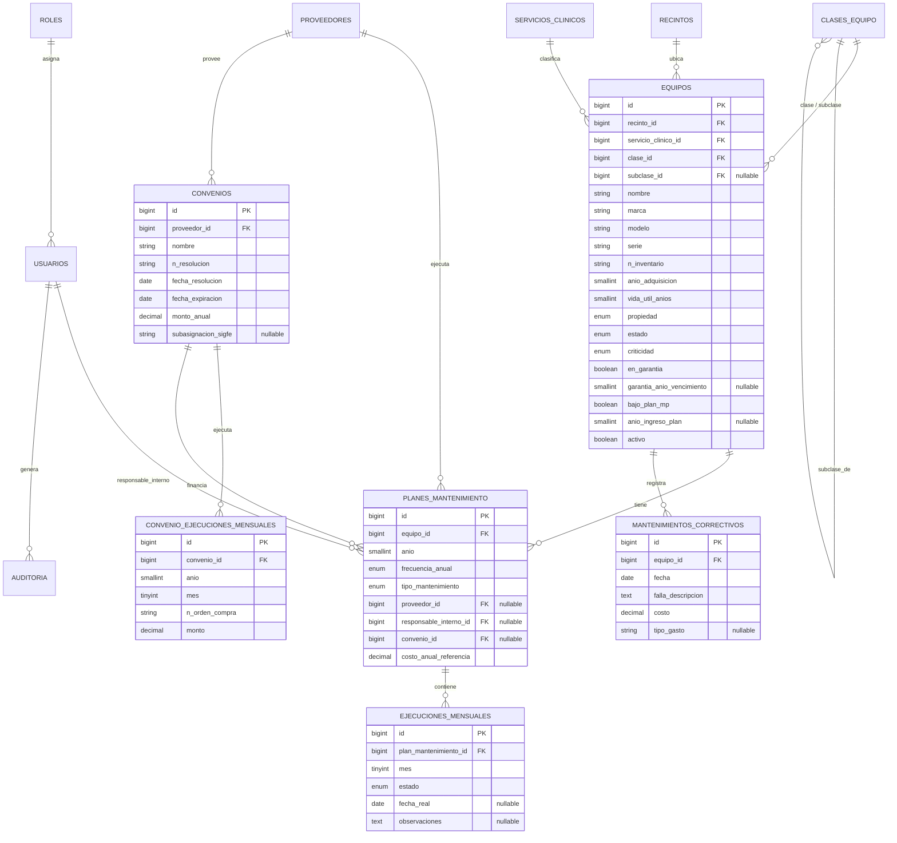

# Modelo de Datos — Sistema de Bitácora de Mantenimiento de Equipos

> Formaliza las entidades candidatas del `BRIEF.md` §2 en un modelo relacional para PostgreSQL
> 16+, con convenciones de nombrado Laravel/Eloquent (tablas en plural, snake_case, migraciones).
> Donde el modelo depende de una pregunta abierta sin resolver, se declara la decisión por defecto
> adoptada y se marca como sujeta a cambio — no se bloquea el diseño esperando cada respuesta.

## §1 Convenciones

- Tablas en snake_case plural (`equipos`, `planes_mantenimiento`).
- Claves primarias `id` (bigint, autoincremental).
- Claves foráneas `<entidad_singular>_id`, con `ON DELETE RESTRICT` por defecto (no se permite
  borrar un catálogo referenciado — RF-04) salvo que se indique lo contrario.
- Catálogos con baja lógica: columna `activo` (boolean, default `true`), nunca `DELETE` físico.
- Timestamps estándar de Laravel (`created_at`, `updated_at`) en todas las tablas; `deleted_at`
  (soft delete) en `equipos`, `convenios` y `mantenimientos_correctivos` por su valor histórico.
- Enums de dominio implementados como `enum` de PostgreSQL o `check constraint`, mapeados a
  PHP Enums de Laravel — no como texto libre (ver `BRIEF.md`, hallazgo del campo Servicio Clínico).

## §2 Diagrama entidad-relación

## §3 Catálogo de entidades

### 3.1 `recintos`

| Campo | Tipo | Nulo | Notas |
|---|---|---|---|
| id | bigint PK | No | |
| nombre | varchar(150) | No | Único |
| activo | boolean | No | default `true` |
| created_at / updated_at | timestamp | No | |

*Justificación*: hoy la planilla trae un solo recinto (Hospital Regional Coyhaique), pero el
encabezado dice "Servicio de Salud Aysén" — se modela como catálogo desde el inicio para no
bloquear la respuesta a la pregunta abierta 1 (alcance de recintos).

### 3.2 `servicios_clinicos`

| Campo | Tipo | Nulo | Notas |
|---|---|---|---|
| id | bigint PK | No | |
| nombre | varchar(150) | No | Único — reemplaza las 110+ variantes de texto libre |
| activo | boolean | No | default `true` |
| created_at / updated_at | timestamp | No | |

*Decisión pendiente (PA-3)*: se modela como catálogo global (no anidado bajo `recintos`), asumiendo
relación **1:N** con `equipos` (un equipo, un servicio clínico). Si el requirente confirma relación
**M:N** (equipo con varios servicios, como se observa en celdas tipo "Uci adultos / Bodega"), se
agrega una tabla pivote `equipo_servicio_clinico` sin romper el resto del modelo.

### 3.3 `clases_equipo`

| Campo | Tipo | Nulo | Notas |
|---|---|---|---|
| id | bigint PK | No | |
| nombre | varchar(150) | No | |
| clase_padre_id | bigint FK → clases_equipo.id | Sí | `NULL` = es una clase; con valor = es una subclase |
| activo | boolean | No | default `true` |

*Diseño*: tabla auto-referenciada de dos niveles (clase → subclase), evita duplicar estructura en
dos tablas separadas y admite que una subclase cambie de clase padre sin migración de esquema.

### 3.4 `proveedores`

| Campo | Tipo | Nulo | Notas |
|---|---|---|---|
| id | bigint PK | No | |
| nombre | varchar(150) | No | |
| rut | varchar(12) | Sí | |
| contacto | varchar(150) | Sí | Teléfono/email de contacto |
| activo | boolean | No | default `true` |

### 3.5 `equipos`

| Campo | Tipo | Nulo | Notas |
|---|---|---|---|
| id | bigint PK | No | |
| recinto_id | bigint FK → recintos.id | No | |
| servicio_clinico_id | bigint FK → servicios_clinicos.id | No | Ver PA-3 |
| clase_id | bigint FK → clases_equipo.id | No | Fila con `clase_padre_id IS NULL` |
| subclase_id | bigint FK → clases_equipo.id | Sí | Fila con `clase_padre_id` = clase_id |
| nombre | varchar(150) | No | |
| marca | varchar(100) | Sí | |
| modelo | varchar(100) | Sí | |
| serie | varchar(100) | Sí | |
| n_inventario | varchar(50) | No | Único **por recinto** (RF-07) |
| anio_adquisicion | smallint | Sí | |
| vida_util_anios | smallint | Sí | |
| propiedad | enum | No | `propio` · `arriendo` · `comodato` · `prestamo` |
| estado | enum | No | `bueno` · `regular` · `malo` · `sin_evaluar` (RF-12) |
| criticidad | enum | No | `critico` · `relevante` · `im_mayor_igual_12` · `no_aplica` |
| en_garantia | boolean | No | default `false` |
| garantia_anio_vencimiento | smallint | Sí | Solo si `en_garantia = true` |
| bajo_plan_mp | boolean | No | default `false` |
| anio_ingreso_plan | smallint | Sí | 2023–2026 en los datos migrados |
| activo | boolean | No | default `true` (baja lógica) |
| created_at / updated_at / deleted_at | timestamp | — | soft delete |

**Índices**: único compuesto `(recinto_id, n_inventario)`; índices simples en `servicio_clinico_id`,
`criticidad`, `estado` (soportan los filtros de RF-11).

**Vida útil residual (RF-09)**: no se persiste como columna — se calcula en tiempo de lectura
(`vida_util_anios - (año_actual - anio_adquisicion)`) para no desincronizarse año a año. Si el
requirente confirma en PA-10 que debe ser un valor editable manualmente, se agrega la columna
`vida_util_residual_manual` como excepción al cálculo.

### 3.6 `planes_mantenimiento`

| Campo | Tipo | Nulo | Notas |
|---|---|---|---|
| id | bigint PK | No | |
| equipo_id | bigint FK → equipos.id | No | |
| anio | smallint | No | |
| frecuencia_anual | enum | No | `1` · `2` · `3` · `4` · `6` · `12` |
| tipo_mantenimiento | enum | No | `interno` · `externo` |
| proveedor_id | bigint FK → proveedores.id | Sí | Obligatorio si `tipo_mantenimiento = externo` |
| responsable_interno_id | bigint FK → usuarios.id | Sí | Obligatorio si `tipo_mantenimiento = interno` |
| convenio_id | bigint FK → convenios.id | Sí | Solo si el mantenimiento externo está bajo convenio |
| costo_anual_referencia | decimal(12,2) | Sí | |
| created_at / updated_at | timestamp | — | |

**Índices**: único compuesto `(equipo_id, anio)` — un plan por equipo y año.

**Regla aplicada (RF-13)**: al insertar/actualizar este registro, una *action* de Laravel genera
automáticamente las 12 filas de `ejecuciones_mensuales` del año, con la cantidad exacta de meses en
estado `programado` según `frecuencia_anual` (RN-01).

### 3.7 `ejecuciones_mensuales` (la "bitácora")

| Campo | Tipo | Nulo | Notas |
|---|---|---|---|
| id | bigint PK | No | |
| plan_mantenimiento_id | bigint FK → planes_mantenimiento.id | No | |
| mes | tinyint | No | 1–12 |
| estado | enum | No | `sin_programar` · `programado` · `realizado` · `reprogramado` |
| fecha_real | date | Sí | Solo si `estado` es `realizado` o `reprogramado` |
| observaciones | text | Sí | |
| created_at / updated_at | timestamp | — | |

**Índices**: único compuesto `(plan_mantenimiento_id, mes)`.

**Regla aplicada (RF-18 / RN-02)**: transición válida solo `programado → realizado` o
`programado → reprogramado`; se rechaza a nivel de Form Request y de Policy cualquier otra
transición (defensa en profundidad, RNF-04).

### 3.8 `mantenimientos_correctivos`

| Campo | Tipo | Nulo | Notas |
|---|---|---|---|
| id | bigint PK | No | |
| equipo_id | bigint FK → equipos.id | No | |
| fecha | date | No | |
| falla_descripcion | text | No | |
| costo | decimal(12,2) | No | |
| tipo_gasto | varchar(100) | Sí | Texto libre por ahora — se normaliza a catálogo si PA-6 confirma categorías fijas |
| created_at / updated_at / deleted_at | timestamp | — | soft delete |

### 3.9 `convenios`

| Campo | Tipo | Nulo | Notas |
|---|---|---|---|
| id | bigint PK | No | |
| proveedor_id | bigint FK → proveedores.id | No | |
| nombre | varchar(150) | No | |
| n_resolucion | varchar(50) | No | |
| fecha_resolucion | date | No | |
| fecha_expiracion | date | No | |
| monto_anual | decimal(14,2) | No | |
| subasignacion_sigfe | varchar(50) | Sí | Referencia manual — ver PA-5 |
| activo | boolean | No | default `true` |
| created_at / updated_at / deleted_at | timestamp | — | soft delete |

### 3.10 `convenio_ejecuciones_mensuales`

| Campo | Tipo | Nulo | Notas |
|---|---|---|---|
| id | bigint PK | No | |
| convenio_id | bigint FK → convenios.id | No | |
| anio | smallint | No | |
| mes | tinyint | No | 1–12 |
| n_orden_compra | varchar(50) | No | Orden de compra o factura |
| monto | decimal(12,2) | No | |
| created_at / updated_at | timestamp | — | |

**Índices**: índice compuesto `(convenio_id, anio, mes)` (no único — un convenio puede tener más
de una orden de compra/factura en el mismo mes).

### 3.11 `usuarios`, roles y permisos (RF-34/RF-35, implementado 2026-09-08)

| Tabla | Origen | Notas |
|---|---|---|
| `usuarios` | propia | id, nombre, email, password, activo — ya no tiene `rol_id`: el rol vive en `model_has_roles` |
| `roles`, `permissions`, `model_has_roles`, `model_has_permissions`, `role_has_permissions` | `spatie/laravel-permission` | Roles de `BRIEF.md` §2.3 (Encargado de Mantención, Técnico Interno, Encargado de Convenios, Jefatura) + `super_admin`; permisos generados por `filament-shield`, uno por acción/recurso de cada Filament Resource |

El supuesto técnico de la versión anterior de esta sección (plugin de roles/permisos nativo de
Filament sobre el paquete estándar de Laravel, no un motor a medida) se confirmó e implementó tal
cual con `spatie/laravel-permission` + `bezhansalleh/filament-shield` (RNF-06/RNF-08 del SRS). La
tabla `roles` propia y su `RoleResource` a medida quedaron reemplazados — no había datos reales
cargados, solo el usuario de prueba sin rol asignado.

*Desviación de formato frente a BRIEF §5*: el formato `modulo.recurso.accion` ahí previsto no
calza con el generador de Shield, que arma un permiso por acción y por **recurso de Filament**
(dos segmentos, no tres) — un recurso no siempre coincide 1:1 con un módulo del BRIEF. Se usó
`accion.recurso` con separador `.` (p. ej. `create.convenio`) como la aproximación más cercana sin
escribir un generador de permisos a medida, que es justamente lo que esta decisión buscaba evitar.
El mapeo de permisos por rol está en `database/seeders/RolesAndPermissionsSeeder.php`.

### 3.12 `audits` (transversal, implementa RF-36, implementado 2026-09-09)

| Campo | Tipo | Notas |
|---|---|---|
| id | bigint PK | |
| user_type / user_id | varchar / bigint | Polimórfico (actor) — en la práctica siempre `App\Models\User` |
| auditable_type / auditable_id | varchar / bigint | Polimórfico: a qué registro afecta |
| event | varchar | `created` · `updated` · `deleted` |
| old_values / new_values | text (JSON serializado) | Solo los campos que cambiaron, no la fila completa |
| url, ip_address, user_agent, tags | — | Metadatos adicionales del paquete, no pedidos por el BRIEF pero sin costo extra |
| created_at, updated_at | timestamp | |

El supuesto técnico de la versión anterior de esta sección (paquete estándar de auditoría en vez
de tabla propia) se confirmó e implementó con `owen-it/laravel-auditing` (RNF-08). Auditados:
`Equipo` (catastro), `PlanMantenimiento`/`EjecucionMensual` (bitácora), `MantenimientoCorrectivo`
y `Convenio`/`ConvenioEjecucionMensual` — el alcance exacto de RF-36 (SRS). Los catálogos
(recintos, servicios clínicos, clases, proveedores) quedan fuera, igual que en el BRIEF.

*Desviación de nombres frente a la versión anterior de esta sección*: se usa la tabla `audits` del
paquete tal cual (no se renombra a `auditoria`/`accion`/`valores_anteriores` en snake plano ni se
fuerza `jsonb`, queda como `text`) — mismo criterio que en §3.11: adoptar el esquema estándar del
paquete es lo que evita mantener un motor a medida, que es lo que esta decisión buscaba evitar en
primer lugar.

*Gotcha operacional*: el paquete desactiva el registro cuando `app()->runningInConsole()` es
verdadero (`config/audit.php` → `console => false`, por defecto, para no ensuciar el log con
seeders o comandos artisan) — así que no se ve nada auditado al probar por `tinker` o en tests
salvo que se fuerce `config(['audit.console' => true])`. En el panel real (petición HTTP normal)
audita sin necesitar ese ajuste.

## §4 Catálogos de valores fijos (enums)

Idénticos a los verificados en la planilla (`BRIEF.md` §2), con su equivalente de columna:

| Campo del modelo | Valores | Origen |
|---|---|---|
| `ejecuciones_mensuales.estado` | `sin_programar` · `programado` · `realizado` · `reprogramado` | Símbolos `X`/`√`/`ꓣ` de la planilla |
| `equipos.criticidad` | `critico` · `relevante` · `im_mayor_igual_12` · `no_aplica` | Columna Criticidad |
| `equipos.propiedad` | `propio` · `arriendo` · `comodato` · `prestamo` | Columna Propiedad |
| `equipos.estado` | `bueno` · `regular` · `malo` · `sin_evaluar` | Columna Estado (+ RF-12) |
| `planes_mantenimiento.tipo_mantenimiento` | `interno` · `externo` | Columna Mantenimiento |
| `planes_mantenimiento.frecuencia_anual` | `1`·`2`·`3`·`4`·`6`·`12` | Columna Frecuencia anual |

## §5 Reglas de integridad derivadas de las RN del BRIEF

| Regla | Mecanismo en el modelo |
|---|---|
| RN-01 (meses programados = frecuencia) | Generado por *action* al crear/editar `planes_mantenimiento`; verificado por test (SRS UC-01/UC-02) |
| RN-02 (transición de estado válida) | Constraint de aplicación (Form Request + Policy) sobre `ejecuciones_mensuales.estado` |
| RN-03 (% cumplimiento) | Vista o query agregada sobre `ejecuciones_mensuales`, no columna almacenada (evita desincronización) |
| RN-04 (gasto MP/MC independiente) | Separación física: `planes_mantenimiento.costo_anual_referencia` (MP) vs. `mantenimientos_correctivos.costo` (MC) |
| RN-05 (conciliación convenio) | Trigger o validación de aplicación al insertar `convenio_ejecuciones_mensuales`: alerta si `SUM(monto) > convenios.monto_anual` |
| RN-06 (vida útil residual) | Cálculo en tiempo de lectura, ver `equipos` §3.5 |
| RN-07 (criterio de criticidad) | No modelado como regla derivada — `criticidad` es un campo capturado, no calculado, hasta que PA-2 defina el criterio |

## §6 Mapeo a convenciones Laravel

- Cada tabla = una migración (`database/migrations/xxxx_create_<tabla>_table.php`) y un modelo
  Eloquent en `app/Models`.
- Relaciones: `Equipo::recinto()`, `Equipo::servicioClinico()`, `Equipo::clase()`,
  `Equipo::subclase()`, `Equipo::planesMantenimiento()`, `Equipo::mantenimientosCorrectivos()`;
  `PlanMantenimiento::ejecucionesMensuales()`; `Convenio::ejecucionesMensuales()`.
- Enums de dominio como PHP 8.4 `enum` con `implements HasLabel` (convención Filament) para que
  las opciones se muestren en español en los `Select` de los formularios.
- Generación automática del plan (RF-13) como una `Action` invocable (`GenerarPlanAnualAction`),
  no lógica embebida en el modelo — facilita testing unitario (RNF-08).

## §7 Supuestos y preguntas abiertas relacionadas al modelo

| Pregunta abierta (BRIEF) | Impacto en el modelo si cambia la respuesta |
|---|---|
| PA-1 Alcance de recintos | Ya soportado — `recintos` es catálogo desde el inicio, sin cambio de esquema |
| PA-2 Criterio de criticidad | Si se define una fórmula, `criticidad` pasa de campo capturado a campo calculado (nueva `Action`, sin cambio de columna) |
| PA-3 Servicio clínico 1:N vs M:N | Si es M:N, se agrega tabla pivote `equipo_servicio_clinico` y se retira `equipos.servicio_clinico_id` |
| PA-5 Integración SIGFE | Si se requiere integración real, `subasignacion_sigfe` deja de ser texto libre y se referencia a un catálogo o servicio externo |
| PA-6 Detalle de mantenimiento correctivo | Si se confirman categorías fijas, `mantenimientos_correctivos.tipo_gasto` pasa de texto libre a catálogo (`tipos_gasto_correctivo`) |
| PA-9 Migración de histórico | Define si se cargan años 2023–2025 en `planes_mantenimiento`/`ejecuciones_mensuales` o solo 2026 |
| PA-10 Vida útil residual | Define si se agrega columna editable manualmente (ver §3.5) |
| PA-12 Autenticación institucional | Si hay SSO/LDAP, `usuarios.password` puede quedar en desuso y se agrega `usuarios.sso_id` |

Estas decisiones no bloquean el inicio de la Etapa 2: el modelo está diseñado para que cada
respuesta del requirente se incorpore como una migración adicional, no como un rediseño.
