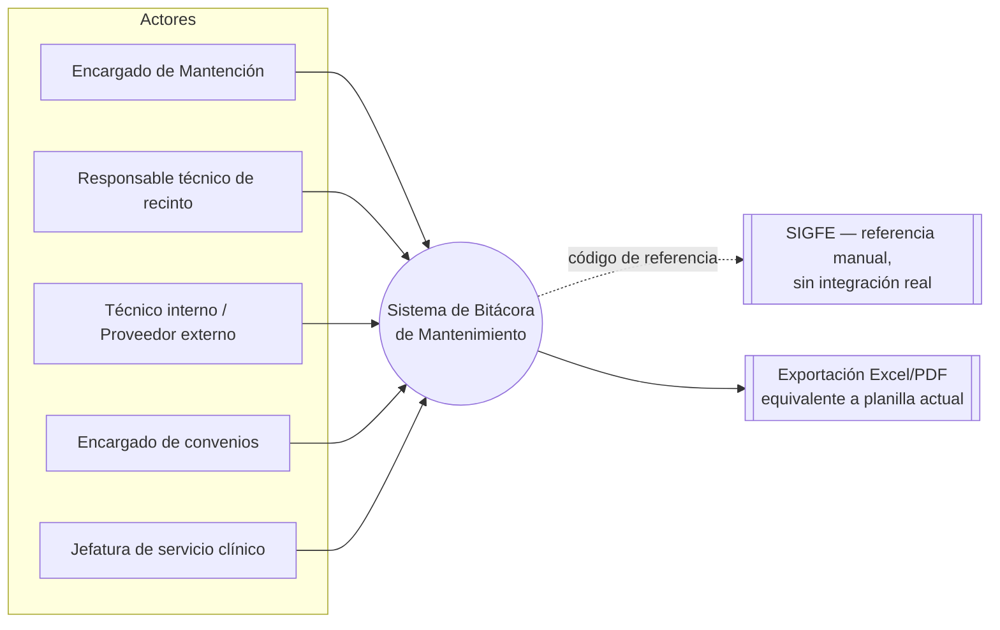
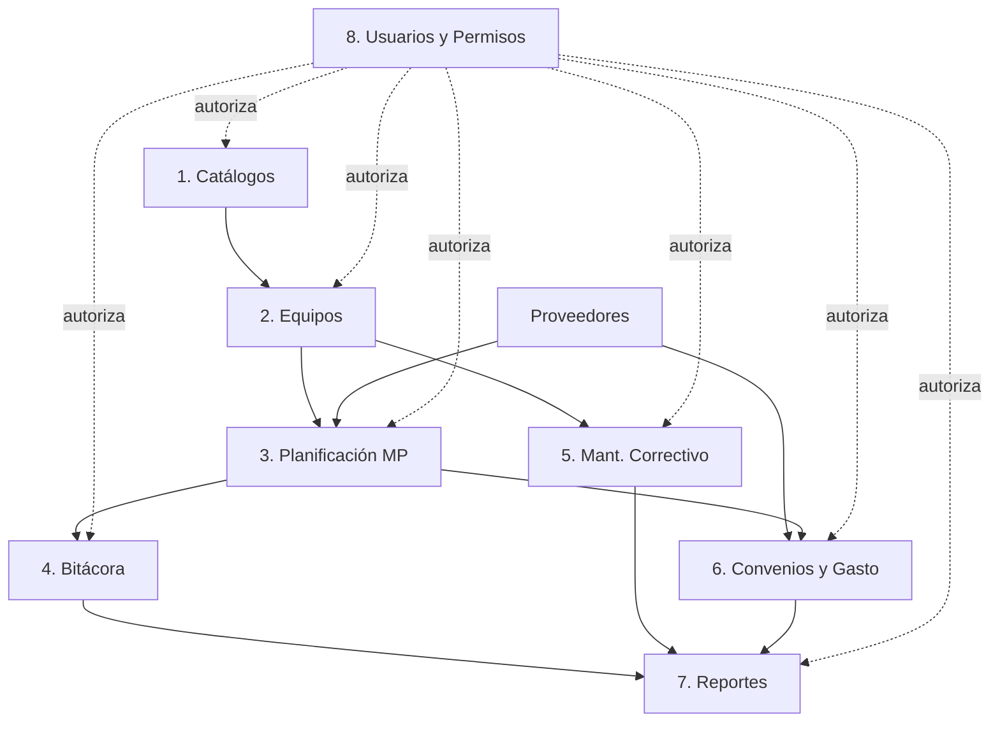
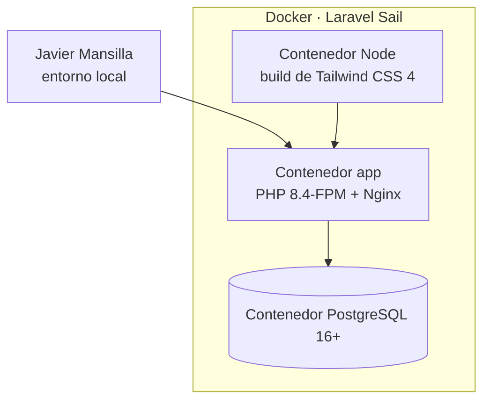
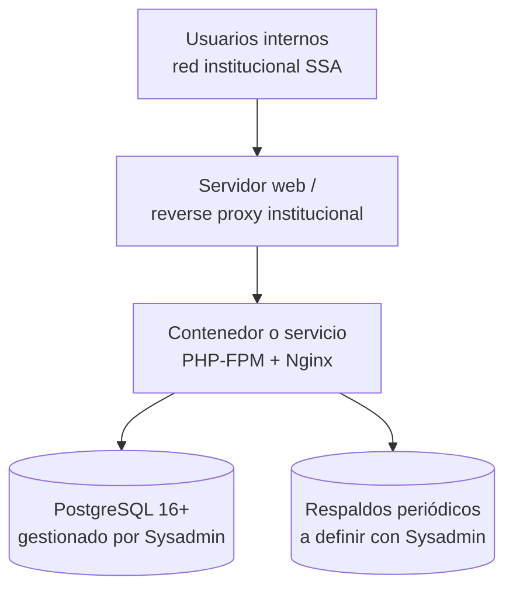

# SAD — Arquitectura de la Solución

> Expande `BRIEF.md` §4 "Arquitectura" en un documento formal, sin apartarse de sus decisiones: se
> agrega la vista de contexto, componentes, datos, despliegue, seguridad y las decisiones de
> arquitectura que en el BRIEF quedaban implícitas. No introduce infraestructura nueva ni
> excepciones al TRA.

## §1 Introducción

### 1.1 Propósito

Documentar las decisiones estructurales del sistema — cómo se dividen sus componentes, cómo se
despliegan y qué atributos de calidad (RNF del `SRS.md`) satisface cada decisión — como guía técnica
para la Etapa 2.

### 1.2 Alcance y restricciones

Aplica al sistema completo definido en `BRIEF.md`/`SRS.md`. Restricción dura: stack TRA §5 (Laravel
13 · Livewire 4 · Filament 5 · PHP 8.4 · PostgreSQL 16+ · Tailwind CSS 4 · Docker/Sail), sin
excepciones a la fecha. El paso a producción es responsabilidad del Sysadmin, fuera de este
documento (se describe el entorno esperado, no se ejecuta el despliegue).

## §2 Vista de contexto

El sistema no depende de ningún servicio externo para operar: SIGFE es una referencia de texto
(§3.4 del SRS), y la exportación es generación local de archivo, no una integración.

## §3 Vista de módulos / componentes

Mismo orden de implementación sugerido en `BRIEF.md` §4, ahora con responsabilidades y
dependencias explícitas:

| Módulo | Responsabilidad | Depende de |
|---|---|---|
| Catálogos | CRUD de recintos, servicios clínicos, clase/subclase, proveedores | — |
| Equipos | Catastro y ficha técnica | Catálogos |
| Planificación MP | Generar y mantener el plan anual por equipo | Equipos, Proveedores, Convenios |
| Bitácora | Registrar ejecución mensual | Planificación MP |
| Mant. Correctivo | Registrar eventos de falla por equipo | Equipos |
| Convenios y Gasto | Gestionar convenios y su ejecución mensual | Proveedores |
| Reportes | Exportar vistas equivalentes a la planilla e indicadores | Bitácora, Mant. Correctivo, Convenios |
| Usuarios y Permisos | Autenticación, roles, autorización transversal | — (consumido por todos) |

**Enfoque**: monolito modular Laravel — cada módulo es un conjunto de Filament Resources +
Actions + Policies dentro de la misma aplicación, no servicios separados. Se descarta una
arquitectura de microservicios: el volumen de datos (≈469 equipos, 5.704 filas históricas) y el
carácter interno de uso no lo justifican (ver ADR-01 en §7).

## §4 Vista de datos

El modelo completo está en `MODELO-DATOS.md`. Resumen de agregados por módulo:

| Módulo | Tablas que gestiona |
|---|---|
| Catálogos | `recintos`, `servicios_clinicos`, `clases_equipo`, `proveedores` |
| Equipos | `equipos` |
| Planificación MP | `planes_mantenimiento` |
| Bitácora | `ejecuciones_mensuales` |
| Mant. Correctivo | `mantenimientos_correctivos` |
| Convenios y Gasto | `convenios`, `convenio_ejecuciones_mensuales` |
| Usuarios y Permisos | `usuarios`, `roles`, `auditoria` |

## §5 Vista de despliegue

### 5.1 Entorno de desarrollo (a cargo del autor)

Laravel Sail entrega este entorno reproducible con un solo `docker compose up`; Laravel Boost queda
instalado para asistencia de desarrollo con IA sobre el propio proyecto (convenciones del TRA).

### 5.2 Entorno de producción (a cargo del Sysadmin — referencial, no ejecutado en este alcance)

Este documento no define el hosting final (servidor propio del Servicio, nube institucional, etc.)
— es criterio del Sysadmin. La única exigencia de esta arquitectura es que el entorno de destino
pueda ejecutar contenedores equivalentes a los de Sail (PHP 8.4, PostgreSQL 16+).

## §6 Seguridad y permisos

- **Autenticación**: por defecto, autenticación local de Laravel (Fortify/Breeze) con contraseña.
  Si el requirente confirma una política de SSO/LDAP institucional (pregunta abierta 12 del
  BRIEF), se sustituye por un *guard* de autenticación adicional — el modelo de `usuarios`
  (`MODELO-DATOS.md` §3.11) ya contempla esta extensión sin romper el esquema.
- **Autorización**: basada en roles y permisos (`modulo.recurso.accion`, definidos en `BRIEF.md`
  §5), implementada con el plugin de permisos de Filament 5 sobre el paquete estándar de Laravel
  para este fin — no un motor de permisos a medida (RNF-06, RNF-08 del SRS).
- **Datos sensibles**: el sistema no gestiona datos personales de pacientes; los datos de mayor
  sensibilidad son montos presupuestarios y datos de proveedores — no se identifica necesidad de
  cifrado a nivel de columna, solo control de acceso por rol.
- **Auditoría**: todo cambio sobre catastro, bitácora, mantenimiento correctivo y convenios queda
  registrado (RF-36, tabla `auditoria`), con usuario, fecha y valores anterior/nuevo.
- **Validación en profundidad**: toda regla de negocio (RN-01 a RN-05) se valida en el backend
  (Form Requests + Policies), no solo en la interfaz Livewire/Filament — de modo que no pueda
  vulnerarse por manipulación directa de una petición (RNF-04 del SRS).

## §7 Decisiones de arquitectura (formato ADR resumido)

### ADR-01 — Monolito modular en vez de microservicios

- **Contexto**: sistema de uso interno, volumen de datos moderado, equipo de desarrollo de una
  persona.
- **Decisión**: monolito modular Laravel, con separación por módulo a nivel de código
  (Resources/Actions/Policies), no de despliegue.
- **Consecuencia**: menor complejidad operativa y de despliegue; more sencillo de mantener para
  el equipo del Servicio a futuro. Si el sistema crece a un volumen o criticidad mayor, se
  reevalúa — no antes.

### ADR-02 — Filament 5 cubre el 100% de la interfaz

- **Contexto**: no existe requerimiento de una interfaz pública ni de una experiencia de usuario
  fuera del panel de administración/gestión.
- **Decisión**: todas las pantallas se construyen como Filament Resources/Pages, sin componentes
  Livewire independientes fuera de Filament salvo necesidad puntual (p. ej. la acción
  "Marcar ejecución del mes" de `BRIEF.md` §5).
- **Consecuencia**: velocidad de desarrollo y consistencia visual; el diseño gráfico queda acotado
  a lo que Filament permite personalizar (documentado como límite conocido en `MOCKUP-SISTEMA.html`).

### ADR-03 — Generación del plan anual como Action idempotente

- **Contexto**: RF-13/RF-15 requieren generar y regenerar marcas "Programado" sin duplicar ni
  perder ejecuciones ya registradas.
- **Decisión**: una `Action` de Laravel (`GenerarPlanAnualAction`) encapsula el algoritmo de
  distribución (RN-01), invocable tanto al crear el plan como al cambiar la frecuencia a mitad de
  año, preservando meses ya marcados `realizado`/`reprogramado`.
- **Consecuencia**: lógica testeable de forma aislada (RNF-08), sin duplicarla entre el formulario
  de creación y el de edición.

### ADR-04 — Cálculos de indicadores por consulta, no por columna almacenada

- **Contexto**: RN-03 (% de cumplimiento) y RN-06 (vida útil residual) dependen de fechas y
  conteos que cambian con el tiempo.
- **Decisión**: se calculan en tiempo de lectura (query agregada o accessor de Eloquent), no se
  almacenan como columna recalculada por un job periódico.
- **Consecuencia**: se elimina la clase de bug que originó parte del problema actual (planilla con
  fórmulas manuales desincronizadas, `BRIEF.md` §1). Costo: si el volumen de datos crece
  significativamente, puede requerir una vista materializada — no necesario al volumen actual
  (RNF-02).

### ADR-05 — Sin integración real con SIGFE por ahora

- **Contexto**: pregunta abierta 5 del BRIEF, sin resolver a la fecha de este documento.
- **Decisión**: `convenios.subasignacion_sigfe` se modela como texto de referencia, no como
  integración.
- **Consecuencia**: si el requirente confirma la necesidad de integración real, se evalúa en un ADR
  nuevo durante la Etapa 2 — no bloquea el resto del sistema.

## §8 Stack tecnológico y justificación

| Capa | Tecnología | Justificación |
|---|---|---|
| Backend | PHP 8.4 + Laravel 13 | Restricción TRA §5; versión LTS del framework con soporte de tipado moderno (enums nativos) |
| Interactividad | Livewire 4 | Restricción TRA §5; evita construir una SPA separada para un panel interno |
| Panel administrativo | Filament 5 | Restricción TRA §5; cubre el 100% de las pantallas (ADR-02) |
| Base de datos | PostgreSQL 16+ | Restricción TRA §5; soporta `enum`, `jsonb` (auditoría) y los volúmenes/consultas agregadas del sistema |
| Estilos | Tailwind CSS 4 | Restricción TRA §5; integrado de forma nativa por Filament |
| Entorno de desarrollo | Docker (Laravel Sail) + Laravel Boost | Restricción TRA §5; reproducibilidad del entorno entre desarrollo y eventual traspaso |

Ninguna decisión de este documento requiere una excepción al TRA; por lo tanto, no se levanta ADR
de excepción (`BRIEF.md` §4 ya lo señalaba).

## §9 Requisitos no funcionales atendidos por la arquitectura

| RNF (SRS) | Cómo lo atiende esta arquitectura |
|---|---|
| RNF-01 Disponibilidad | Monolito simple (ADR-01), sin dependencias externas críticas (§2) |
| RNF-02 Rendimiento | Índices definidos en `MODELO-DATOS.md` §3.5/§3.6; cálculos por consulta (ADR-04) dimensionados al volumen actual |
| RNF-03 Seguridad | §6 — autenticación + autorización por rol |
| RNF-04 Integridad de datos | Validación en backend (Form Requests/Policies), no solo en UI |
| RNF-05 Auditabilidad | Tabla `auditoria` transversal (§6) |
| RNF-06 Usabilidad | ADR-02 — componentes estándar de Filament |
| RNF-07 Portabilidad | Docker/Sail (§5.1) |
| RNF-08 Mantenibilidad | Actions/Policies/Form Requests como patrón (ADR-03) |
| RNF-09 Compatibilidad de exportación | Módulo Reportes genera archivos Excel/PDF estándar, sin formato propietario |

## §10 Riesgos técnicos y mitigación

| Riesgo | Probabilidad | Impacto | Mitigación |
|---|---|---|---|
| El criterio real de criticidad (PA-2) implica una regla más compleja de lo modelado | Media | Media | `criticidad` es campo capturado, no calculado (§7 MODELO-DATOS) — cambiar a fórmula no rompe el esquema |
| La cardinalidad real de servicio clínico es M:N (PA-3) | Media | Baja | Modelo preparado para agregar tabla pivote sin rediseño (§7 MODELO-DATOS) |
| Requisito tardío de SSO/LDAP (PA-12) | Baja | Media | Esquema de `usuarios` ya deja espacio para *guard* adicional (§6) |
| Volumen de datos crece más allá de lo esperado (nuevos recintos, PA-1) | Baja | Media | Catálogo `recintos` ya existe desde el inicio; no requiere migración estructural |

## §11 Fuera de alcance de este documento

- Configuración final del servidor de producción (Sysadmin).
- Integración real con SIGFE, mientras no se confirme en PA-5.
- Diseño visual final de marca (ver `MOCKUP-SISTEMA.html` — wireframe, no diseño terminado).
